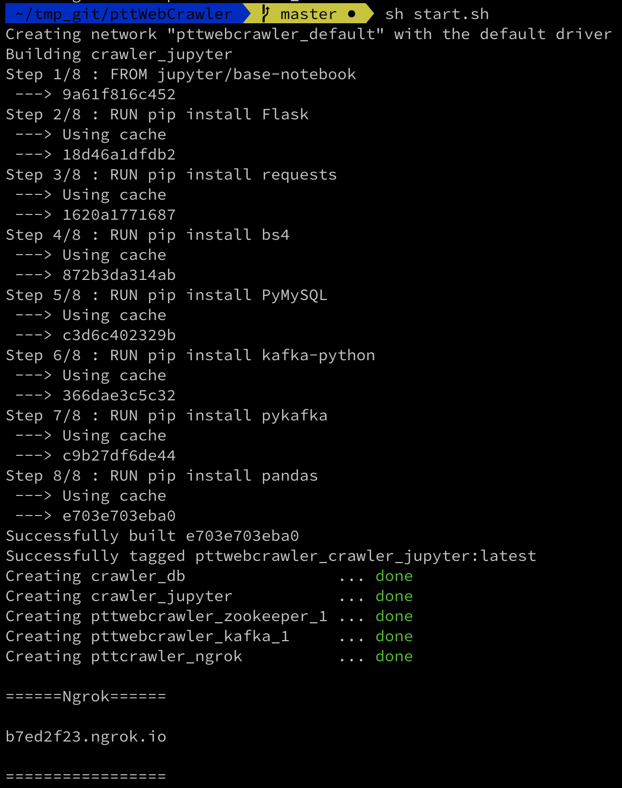
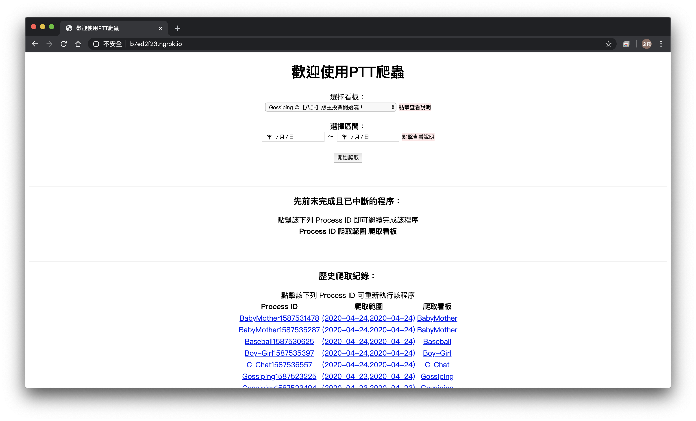
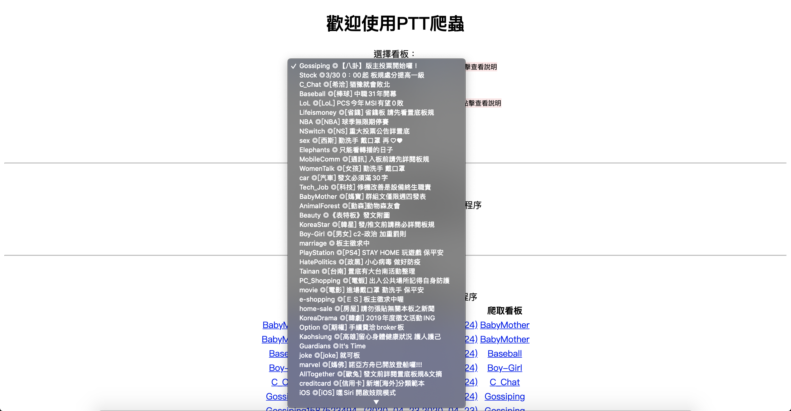
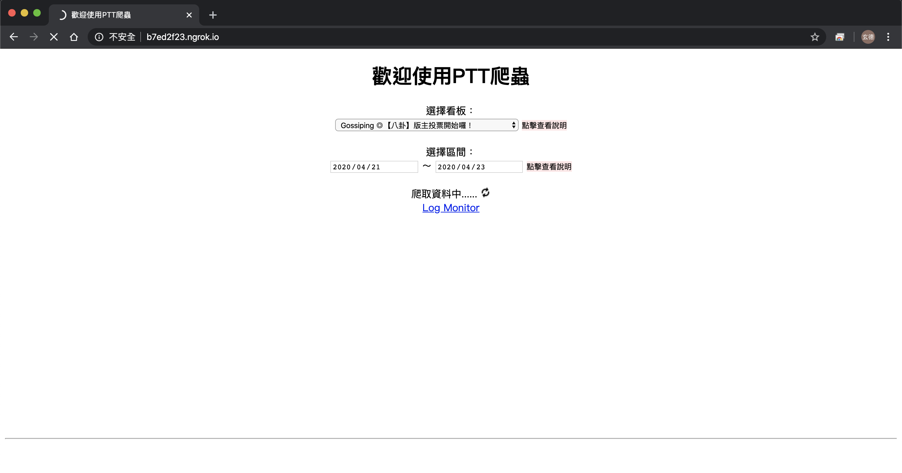
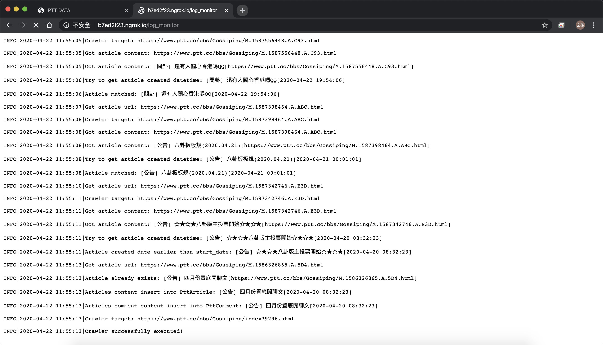

# 啟動步驟
## 1. 於終端機輸入指令下載檔案
`git clone https://github.com/uuboyscy/pttWebCrawler.git`
## 2. 進入程式所在目錄
`cd pttWebCrawler`
## 3. 啟動爬蟲網頁伺服器
`sh start.sh`
#### 接著會看到以下畫面
最下方的 Ngrok 內顯示的網址即為 WebUI 的位址 
直接將該網址複製貼在瀏覽器即可

---------------------
# 進入網頁畫面後的操作
## 1. 直接填選欲爬取資訊
- 下拉式表單選擇欲爬取看板
- 選擇欲爬取時間範圍
- 點選「開始爬取」即進入爬蟲程序(該畫面請勿關閉)
- 開始爬取時，點選下方「Log Monitor」可進入即時Log監控畫面
首頁選填資料

下拉選單選擇看板

