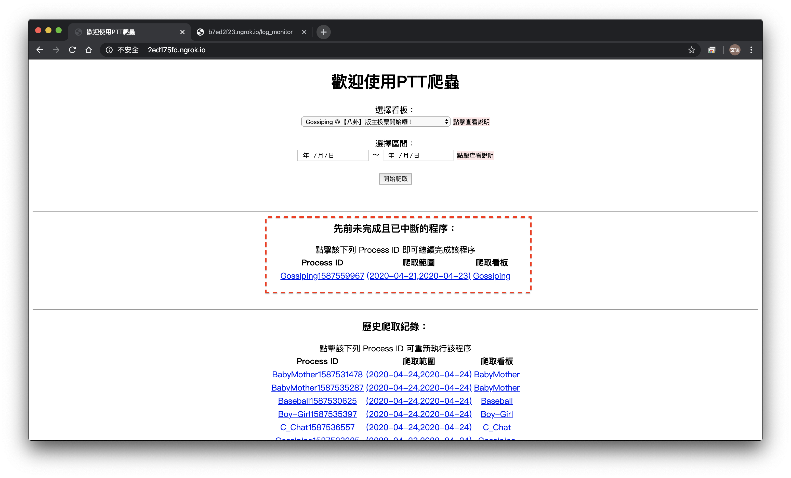
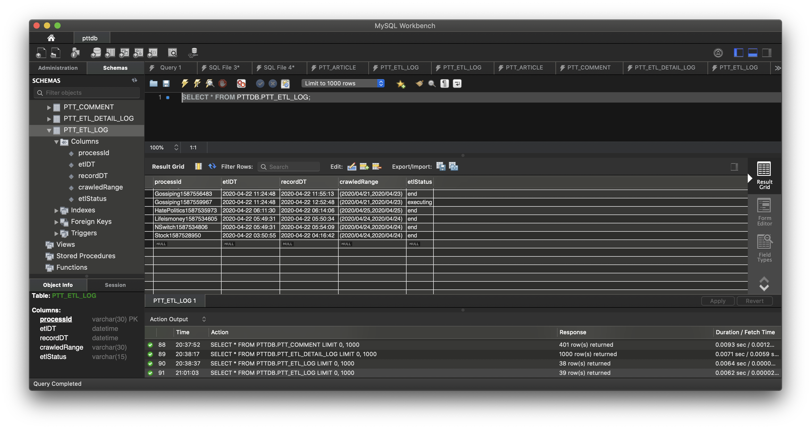
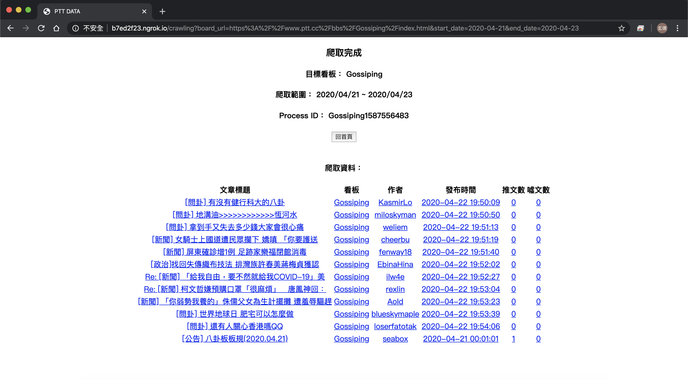
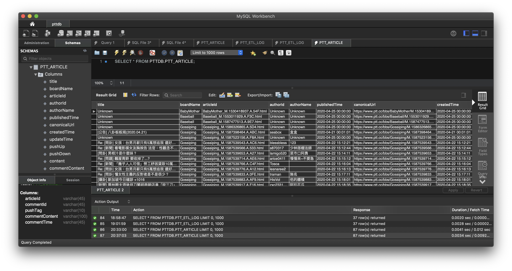
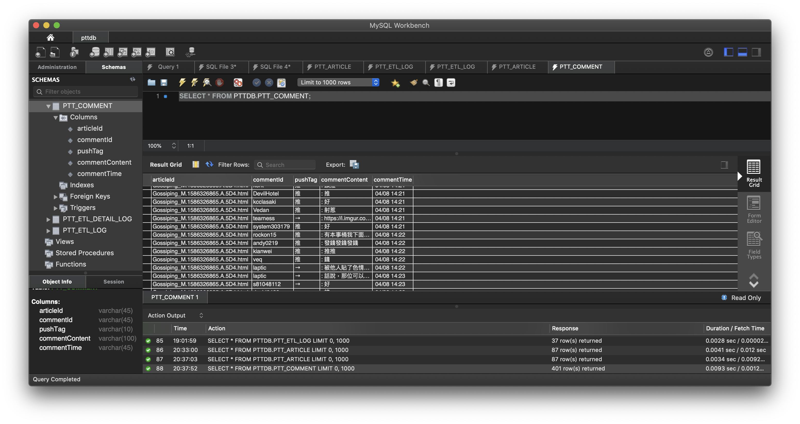
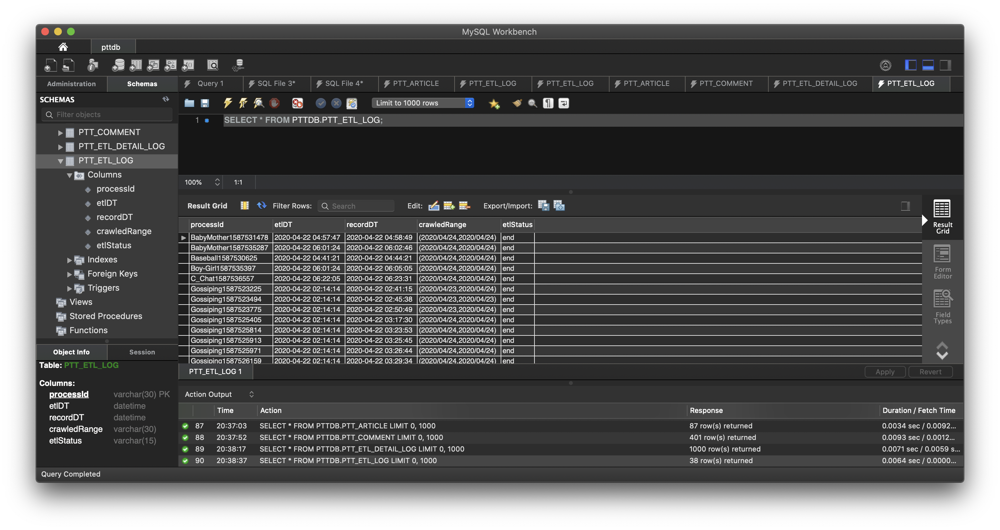
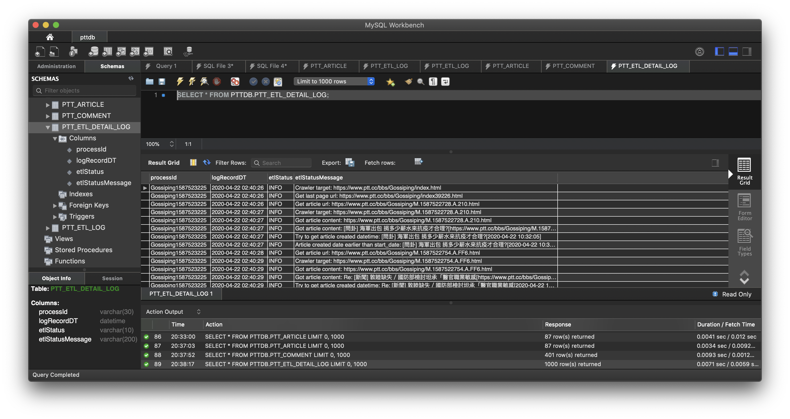
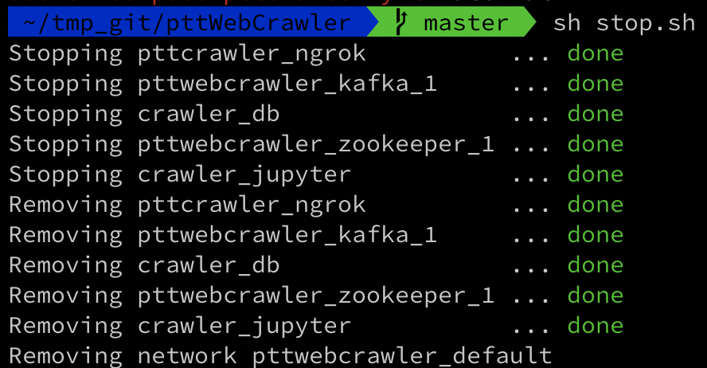

# 環境需求
## 須先安裝Git、Docker、Docker-compose

* * *

# 啟動步驟
## 1. 於終端機輸入指令下載檔案
`git clone https://github.com/uuboyscy/pttWebCrawler.git`
## 2. 進入程式所在目錄
`cd pttWebCrawler`
## 3. 啟動爬蟲網頁伺服器
`sh start.sh`
#### 接著會看到以下畫面
>最下方的 Ngrok 內顯示的網址即為 WebUI 的位址 
>直接將該網址複製貼在瀏覽器即可

* * *

# 進入網頁畫面後的操作
## 1. 直接填選欲爬取資訊
- 下拉式表單選擇欲爬取看板
- 選擇欲爬取時間範圍
- 點選「開始爬取」即進入爬蟲程序(該畫面請勿關閉)
- 開始爬取時，點選下方「Log Monitor」可進入即時Log監控畫面
>首頁選填資料

>下拉選單選擇看板

>開始爬取，下方Log Monitor可觀看即時Log

>爬取時不斷向Kafka consum log

## 2. 若爬蟲程式意外停止，重開後可選擇繼續執行
>爬蟲程式開始執行後，PTTDB.PTT_ETL_LOG中會出現一筆statusId為executing的資料
>若此資料的紀錄時間與現在時間相隔超過15分鐘，則判定為異常
>網頁中「先前未完成且已中斷的程序」處會出現該程序的相關資料，如下圖
>直接點選即可繼續將為爬取資料爬完
>執行完畢後，PTTDB.PTT_ETL_LOG中該筆資料的statusId將變為end

* * *

# 爬取完成後
## 1. 可看到該次爬取的資訊
- Process ID
- 爬取區間
- 爬取目標
- 爬取資料之表格
>爬取結束的畫面

## 2. 爬取結束後可於資料庫查看資料(4個Tables)
- PTTDB.PTT_ARTICLE
- PTTDB.PTT_COMMENT
- PTTDB.PTT_ETL_LOG
- PTTDB.PTT_ETL_DETAIL_LOG
>文章資訊及內容(PK 為 articleId)

>文章留言(FK 為 articleId，可用來與 PTTDB.PTT_ARTICLE 進行 JOIN)

>爬蟲啟動結束之狀態(PK 為 processId。executing為執行中，end為結束)

>爬蟲過程詳細log，包含爬了哪些文章、遇到什麼問題、上傳資料庫或Kafka等(FK 為 processId，可與 PTTDB.PTT_ETL_LOG 進行 JOIN)

* * *

# 關閉程式
## 1. 於終端機輸入指令
`sh stop.sh`
#### 接著會看到以下畫面

* * *
